# Abogabot
Repositorio de desarrrollo FullStack

## Descripción de la práctica
Crear una pagina web que capture las solicitudes de usuarios, estos usuario podrán agregar todos sus datos e incluso los de pago, para que el administrador
pueda checarlos y atenderlos, cuando se atiendan, el administrador debe poder subir la notificación de seguimiento de la solicitud al correo del usuario.

## 1. Toma de requerimientos
Requerimientos necesarios y básicos para que funcione la aplicación web.

**UX/UI del cliente**
- Formulario para llenar una solicitud
- Registrar usuario
- Checkout
- Ver resumen de las solicitudes
- Ver seguimiento de cada solicitud
- Responsive

**UX/UI del administrador**
- Iniciar sesión
- Ver resumen de todas las solicitudes
- Crear detalles de seguimiento de cada solicitud
- Ver usuarios agregados a la aplicación

**Diagrama de flujo de la aplicación web:**

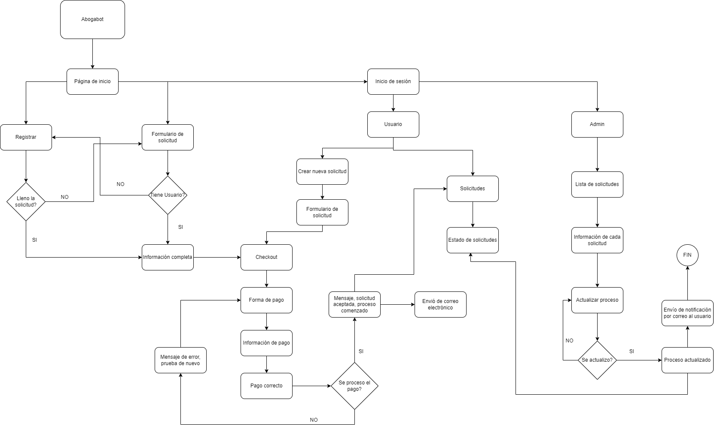

## 1.1 Buyer Persona
Se analiza y se define el cliente al cual va dirigida la aplicación web. Se utiliza el formato entregado en el curso.

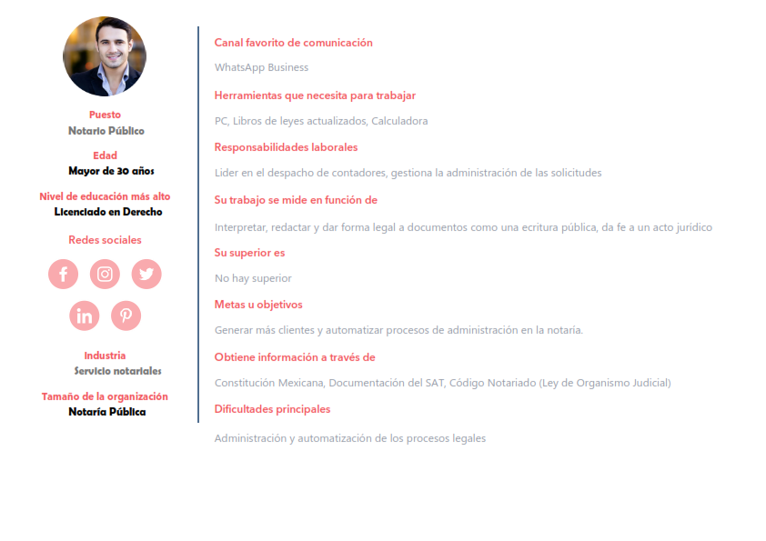

## 2. Público objetivo
Se define quienes son los usarios finales que van a utilizar la aplicación web y se analiza para determinar el funcionamiento y el diseño de la aplicación. Se utiliza la plantilla de referencia en: https://miro.com/app/board/uXjVPQi3IJ4=/

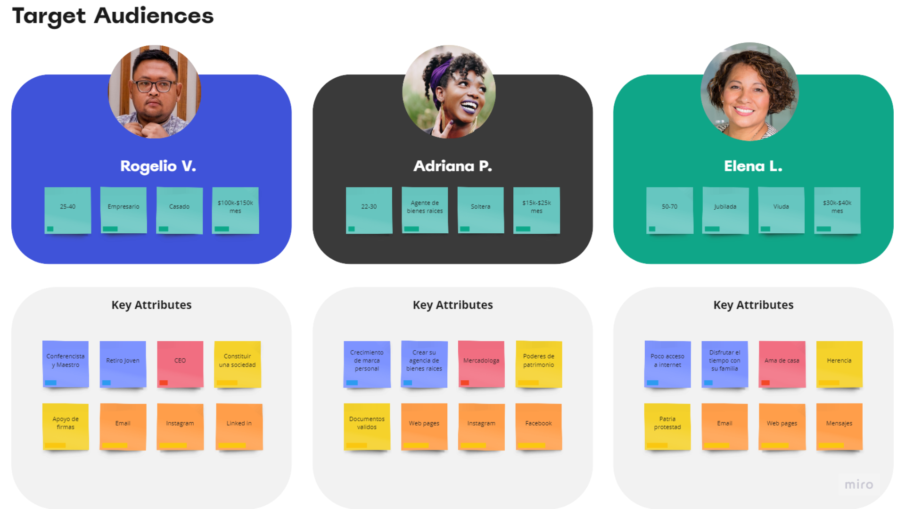

## 3. Wireframe
Se muestra el primer diseño de lo que podría ser la estructura antes de pasar al UI, se nota el acomodo de los componentes. Se utiliza la herramienta de adobe xd en: https://helpx.adobe.com/mx/xd/get-started.html

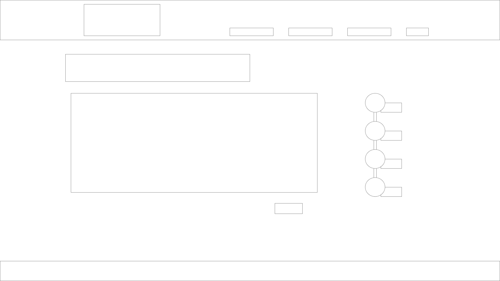
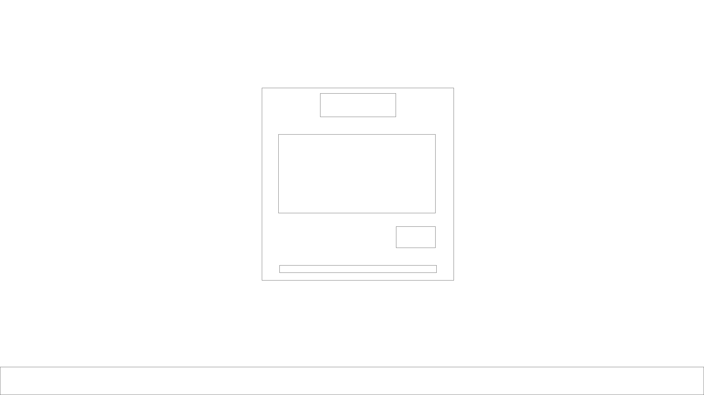
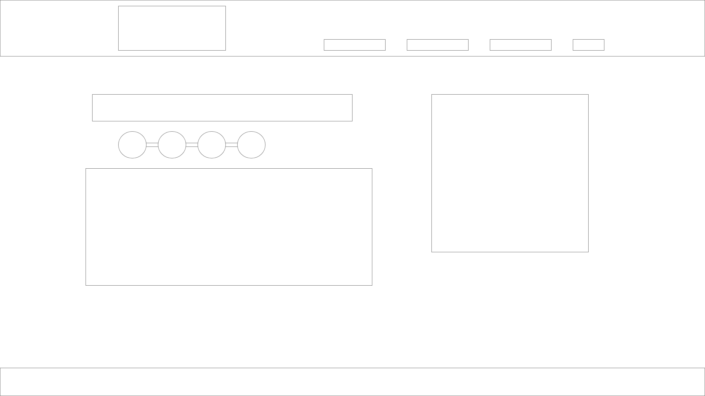
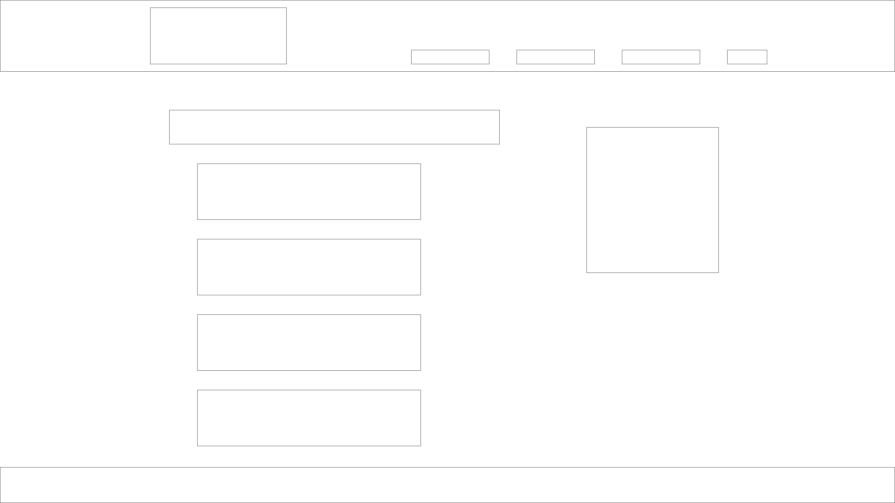
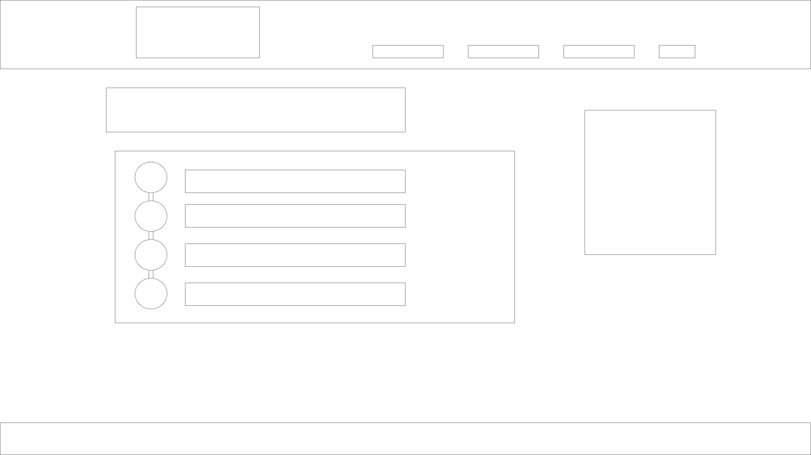

## 4. Diseño UI
Se muestra el diseño final de como quedaría nuestra aplicación web desde el navegador justo antes de empezar a programar. Se utiliza la plataforma de adobe xd en: https://helpx.adobe.com/mx/xd/get-started.html

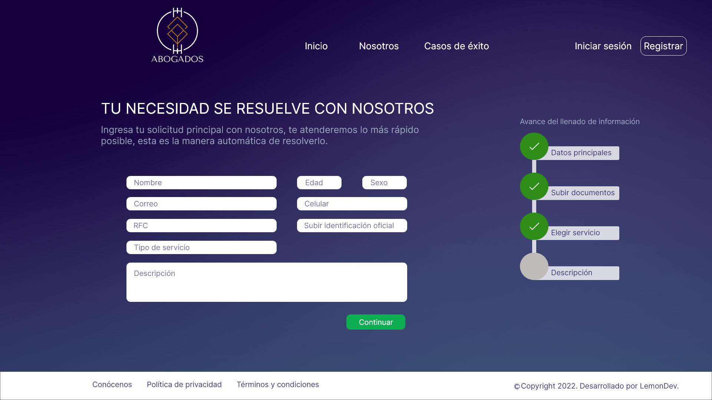
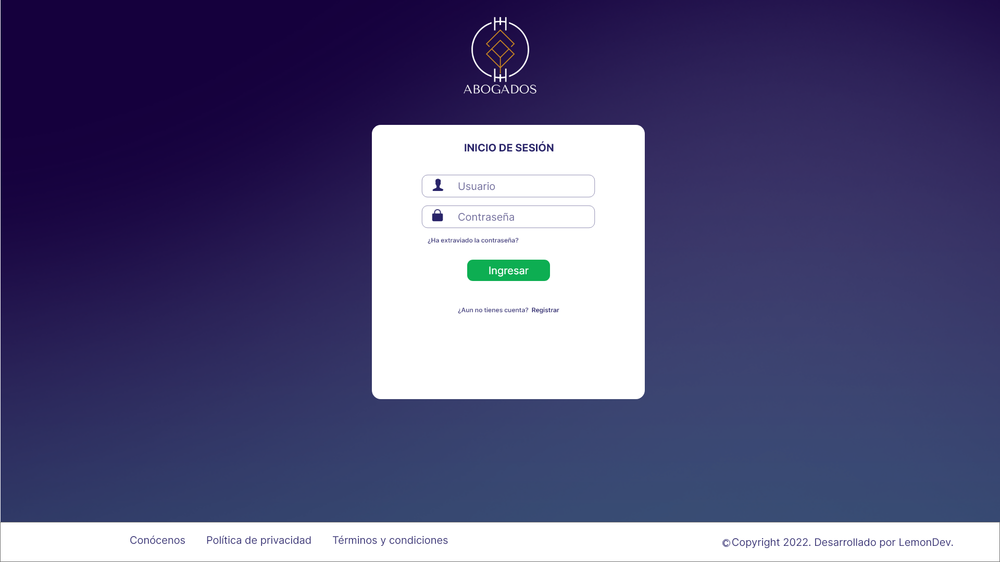
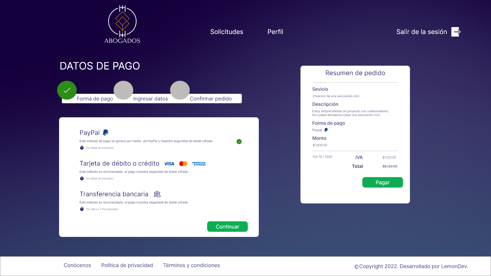
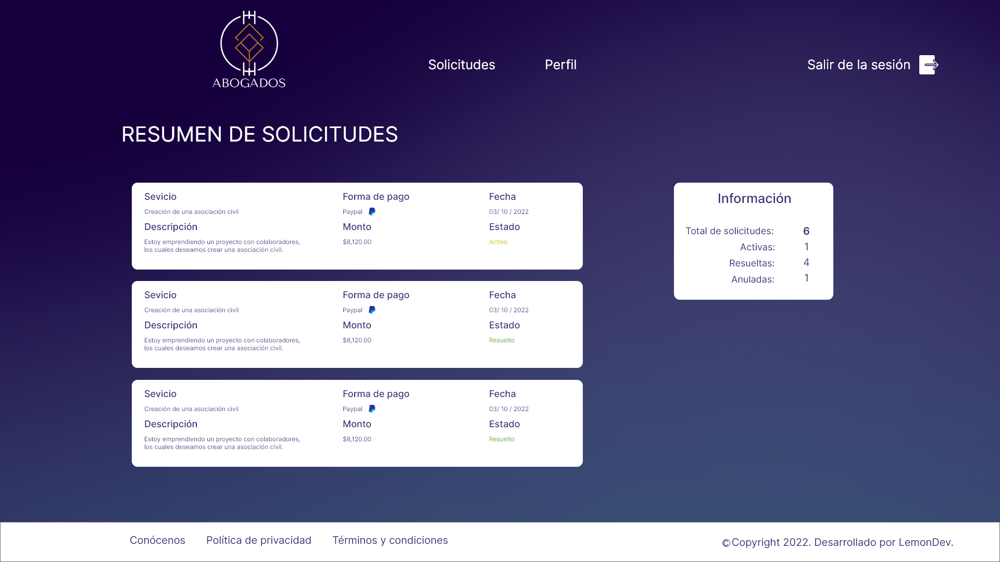
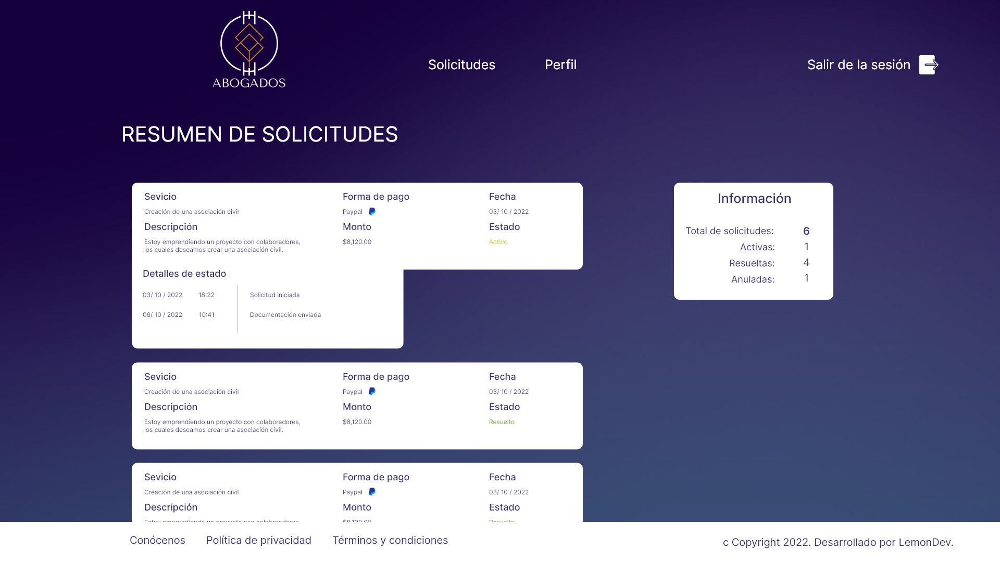
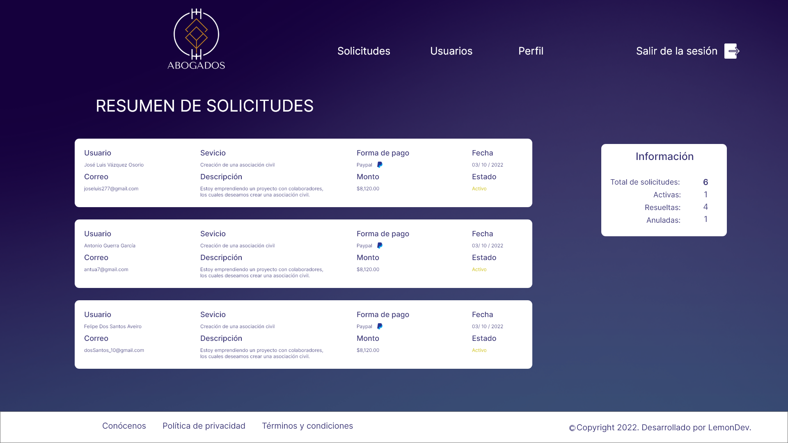
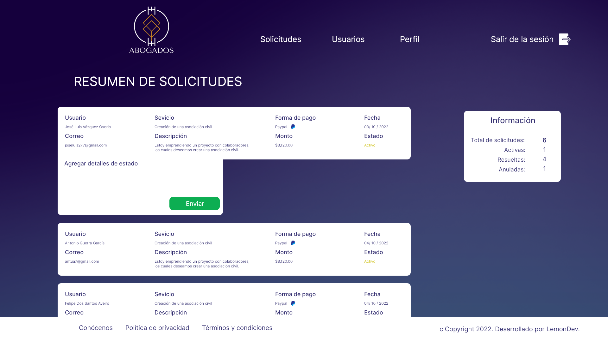

